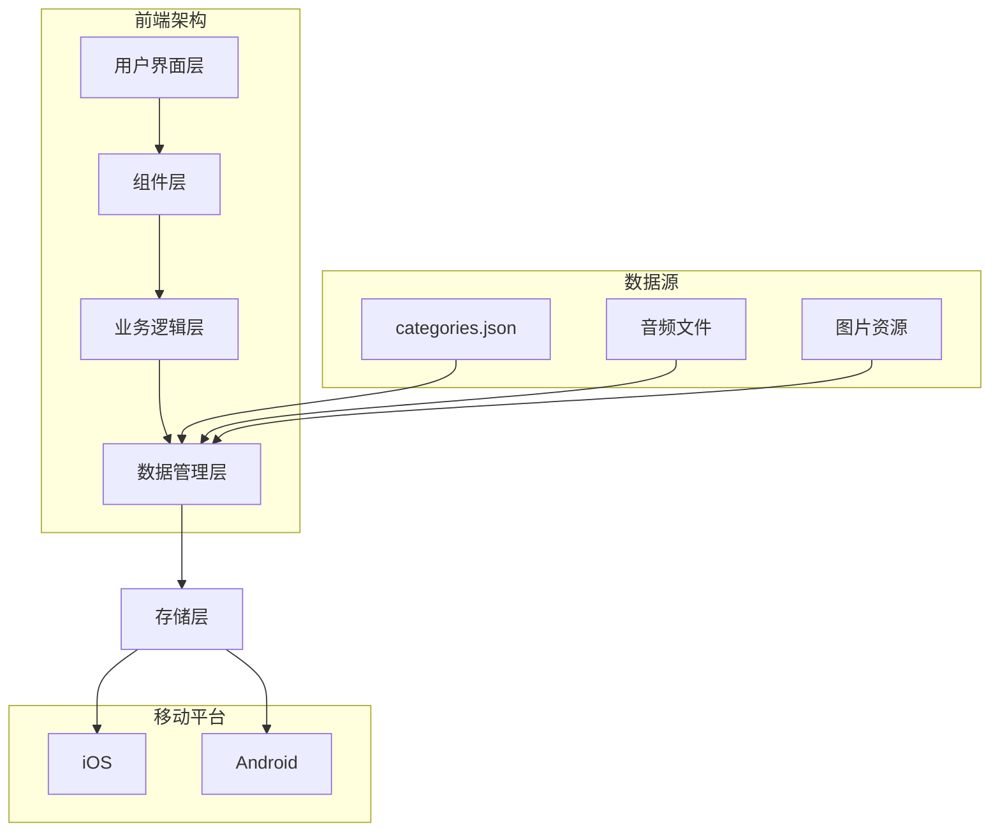

# 卡通英语闪卡APP - 技术方案文档

## 1. 项目概述

### 1.1 项目简介
卡通英语闪卡APP是一款面向3-6岁非英语母语儿童的英语学习应用，通过卡通闪卡和趣味游戏帮助儿童建立英语词汇基础。本项目基于现有的categories.json数据结构，开发纯前端移动应用。

### 1.2 技术目标
- **跨平台兼容**：支持iOS、Android移动设备
- **纯前端架构**：无需后端服务，降低部署复杂度
- **高性能体验**：流畅的动画和交互，优秀的用户体验
- **可维护性**：清晰的代码结构，易于扩展和维护
- **离线优先**：支持离线使用核心功能

### 1.3 核心功能
- 闪卡学习系统（22个分类，3000+词汇）
- 6个趣味学习游戏
- 学习进度追踪和成就系统
- 家长控制和监控功能
- 本地数据存储和同步

## 2. 技术架构

### 2.1 整体架构图



### 2.2 架构设计原则
- **组件化开发**：UI组件高度复用，业务逻辑模块化
- **数据驱动**：状态管理统一，数据流向清晰
- **渐进式增强**：核心功能优先，增强功能渐进加载
- **性能优先**：懒加载、代码分割、资源优化
- **类型安全**：全面使用TypeScript，减少运行时错误

## 3. 技术栈选型

### 3.1 核心框架

#### 3.1.1 React 18+
**选择理由：**
- 生态系统成熟，社区支持强大
- 组件化开发模式，代码复用性高
- React 18并发特性，性能优化出色
- TypeScript原生支持，类型安全保障

**主要特性使用：**
- Concurrent Features (并发渲染)
- Automatic Batching (自动批处理)
- Suspense (异步组件加载)
- useTransition (状态过渡)

#### 3.1.2 TypeScript 5.0+
**选择理由：**
- 静态类型检查，减少运行时错误
- 优秀的IDE支持和代码提示
- 接口定义清晰，团队协作友好
- 与React生态系统完美集成

**类型策略：**
- 严格模式 (`strict: true`)
- 路径映射配置，简化导入路径
- 泛型组件设计，提高复用性
- 联合类型和类型守卫，确保类型安全

### 3.2 移动端框架

#### 3.2.1 Capacitor 5.0+
**选择理由：**
- 基于Web技术，开发效率高
- 原生功能访问能力强大
- 插件生态系统完善
- 支持渐进式Web应用(PWA)

**核心插件：**
- @capacitor/app: 应用生命周期管理
- @capacitor/haptics: 触觉反馈
- @capacitor/local-notifications: 本地通知
- @capacitor/splash-screen: 启动屏幕
- @capacitor/status-bar: 状态栏管理
- @capacitor/storage: 本地存储

#### 3.2.2 React Router v6
**选择理由：**
- 声明式路由，代码简洁
- 嵌套路由支持，复杂场景友好
- 代码分割和懒加载支持
- 类型安全的路由参数

### 3.3 UI组件库

#### 3.3.1 Ant Design Mobile
**选择理由：**
- 移动端优化，触摸友好
- 组件丰富，覆盖核心需求
- 设计规范完善，一致性高
- 支持主题定制和样式覆盖

**主要组件：**
- Button, Card, List, Grid
- Form, Input, Picker
- Modal, Toast, ActionSheet
- NavBar, TabBar

#### 3.3.2 自定义组件补充
**动画组件：**
- Framer Motion: 高性能动画库
- React Spring: 物理动画引擎

**游戏组件：**
- 自制游戏引擎组件
- Canvas/WebGL游戏渲染

### 3.4 状态管理

#### 3.4.1 Zustand
**选择理由：**
- 轻量级，bundle体积小
- API简洁，学习成本低
- TypeScript支持优秀
- 支持中间件和持久化

**Store结构：**
```typescript
// 应用状态
useAppStore: {
  user, settings, progress, theme
}

// 游戏状态
useGameStore: {
  currentGame, score, rounds, time
}

// UI状态
useUIStore: {
  loading, modals, navigation
}
```

### 3.5 样式方案

#### 3.5.1 Styled-components
**选择理由：**
- CSS-in-JS方案，组件化样式
- 动态样式支持，主题切换方便
- 无CSS类名冲突，样式隔离性好
- 服务端渲染支持

**样式策略：**
- 设计系统统一管理
- 主题变量集中定义
- 响应式设计内置支持
- CSS动画性能优化

#### 3.5.2 CSS变量 + Styled-components混合方案
**优势：**
- 主题切换性能优秀
- 运行时样式覆盖方便
- 开发体验友好
- 浏览器兼容性好

### 3.6 动画和交互

#### 3.6.1 Framer Motion
**选择理由：**
- React生态最佳动画库
- 手势支持完善，移动端友好
- 性能优秀，GPU加速
- 动画API简洁易用

**主要特性：**
- Variant动画变体
- 手势识别和拖拽
- 布局动画(Layout Animation)
- 共享元素动画(Shared Layout)

#### 3.6.2 Three.js (可选)
**应用场景：**
- 3D卡片翻转效果
- 粒子动画效果
- 复杂游戏场景渲染
- WebGL性能优化

### 3.7 构建工具

#### 3.7.1 Vite 4.0+
**选择理由：**
- 开发服务器启动极快
- HMR(热模块替换)性能优秀
- 原生ES模块支持
- 构建性能出色，输出优化好

**核心配置：**
- TypeScript支持 (`@vitejs/plugin-react`)
- 路径别名配置
- 环境变量管理
- 构建优化配置

#### 3.7.2 SWC (Speedy Web Compiler)
**选择理由：**
- Rust编写，编译速度快
- 与TypeScript完美集成
- 支持现代JavaScript特性
- Vite内置支持

### 3.8 数据存储

#### 3.8.1 本地存储策略
**存储层级：**
1. **内存存储**: Zustand Store (运行时状态)
2. **会话存储**: SessionStorage (临时数据)
3. **持久存储**: LocalStorage (用户设置、进度)
4. **原生存储**: Capacitor Storage (敏感数据)

**数据结构设计：**
```typescript
interface LocalStorageData {
  user: UserProfile;
  progress: LearningProgress;
  settings: AppSettings;
  gameScores: GameScores;
}
```

#### 3.8.2 数据同步策略
- **离线优先**: 核心功能支持离线使用
- **增量同步**: 只同步变更数据
- **冲突解决**: 时间戳优先策略
- **备份恢复**: 本地备份和恢复机制

### 3.9 音频处理

#### 3.9.1 Web Audio API
**音频格式支持：**
- MP3: 兼容性最好
- AAC: 质量体积比优秀
- WAV: 无损音质
- WebM: 现代浏览器支持

**音频功能：**
- 预加载和缓存策略
- 播放控制和状态管理
- 音量控制和淡入淡出
- 音频可视化效果

#### 3.9.2 音频优化
- **懒加载**: 按需加载音频文件
- **压缩优化**: 音频文件压缩和格式转换
- **缓存策略**: LRU缓存算法
- **预加载**: 智能预加载下一个音频

### 3.10 图像处理

#### 3.10.1 图像格式策略
**格式选择：**
- WebP: 现代格式，体积小质量好
- PNG: 透明图像支持
- JPEG: 照片类图像
- SVG: 矢量图标和插画

**响应式图像：**
- 多分辨率适配
- 懒加载实现
- 渐进式加载
- 占位图显示

#### 3.10.2 图像优化
- **压缩优化**: 自动压缩和格式转换
- **CDN加速**: 静态资源CDN分发
- **缓存策略**: 浏览器缓存和Service Worker
- **懒加载**: 视口内加载

## 4. 项目目录结构

### 4.1 完整目录结构

```
cartoon-english-flashcard/
├── .docs/                           # 项目文档
│   ├── product-requirements.md      # 产品需求文档
│   ├── ui-design-system.md         # UI设计规范
│   ├── figma-designs.md            # Figma设计文档
│   ├── technical-specifications.md # 技术方案文档
│   └── react-components.md         # React组件文档
├── src/                            # 源代码目录
│   ├── components/                 # 组件库
│   │   ├── ui/                     # 基础UI组件
│   │   │   ├── Button/
│   │   │   │   ├── Button.tsx
│   │   │   │   ├── Button.stories.tsx
│   │   │   │   ├── Button.test.tsx
│   │   │   │   └── index.ts
│   │   │   ├── Card/
│   │   │   ├── Input/
│   │   │   ├── Modal/
│   │   │   ├── Loading/
│   │   │   └── index.ts
│   │   ├── flashcard/              # 闪卡相关组件
│   │   │   ├── Flashcard/
│   │   │   ├── FlashcardList/
│   │   │   ├── CategorySelector/
│   │   │   └── index.ts
│   │   ├── game/                   # 游戏组件
│   │   │   ├── SoundTreasureHunt/
│   │   │   ├── MagicPuzzle/
│   │   │   ├── RainbowBubbles/
│   │   │   ├── AnimalMusicBox/
│   │   │   ├── MemoryFlip/
│   │   │   ├── WordArtist/
│   │   │   └── index.ts
│   │   ├── layout/                 # 布局组件
│   │   │   ├── Header/
│   │   │   ├── Footer/
│   │   │   ├── Navigation/
│   │   │   ├── Sidebar/
│   │   │   └── index.ts
│   │   └── common/                 # 通用组件
│   │       ├── ErrorBoundary/
│   │       ├── NotFound/
│   │       ├── LoadingScreen/
│   │       └── index.ts
│   ├── screens/                    # 页面组件
│   │   ├── Onboarding/
│   │   │   ├── WelcomeScreen.tsx
│   │   │   ├── AgeSelectionScreen.tsx
│   │   │   └── index.ts
│   │   ├── Home/
│   │   │   ├── HomeScreen.tsx
│   │   │   ├── components/
│   │   │   └── index.ts
│   │   ├── Learning/
│   │   │   ├── FlashcardScreen.tsx
│   │   │   ├── CategoryScreen.tsx
│   │   │   └── index.ts
│   │   ├── Games/
│   │   │   ├── GameCenterScreen.tsx
│   │   │   ├── GameScreen.tsx
│   │   │   └── index.ts
│   │   ├── Progress/
│   │   │   ├── ProgressScreen.tsx
│   │   │   ├── ReportScreen.tsx
│   │   │   └── index.ts
│   │   ├── Parents/
│   │   │   ├── ParentDashboard.tsx
│   │   │   ├── SettingsScreen.tsx
│   │   │   └── index.ts
│   │   └── index.ts
│   ├── hooks/                      # 自定义Hooks
│   │   ├── useAudioPlayer.ts
│   │   ├── useHaptic.ts
│   │   ├── useLocalStorage.ts
│   │   ├── useGameLogic.ts
│   │   ├── useProgress.ts
│   │   ├── useAnimation.ts
│   │   └── index.ts
│   ├── stores/                     # 状态管理
│   │   ├── useAppStore.ts
│   │   ├── useGameStore.ts
│   │   ├── useUIStore.ts
│   │   ├── useProgressStore.ts
│   │   └── index.ts
│   ├── services/                   # 服务层
│   │   ├── api/
│   │   │   ├── categories.ts
│   │   │   ├── audio.ts
│   │   │   ├── images.ts
│   │   │   └── index.ts
│   │   ├── storage/
│   │   │   ├── local-storage.ts
│   │   │   ├── secure-storage.ts
│   │   │   └── index.ts
│   │   ├── audio/
│   │   │   ├── audio-manager.ts
│   │   │   ├── tts-service.ts
│   │   │   └── index.ts
│   │   └── index.ts
│   ├── utils/                      # 工具函数
│   │   ├── constants/
│   │   │   ├── game-config.ts
│   │   │   ├── animation-config.ts
│   │   │   └── index.ts
│   │   ├── helpers/
│   │   │   ├── format.ts
│   │   │   ├── validation.ts
│   │   │   ├── storage.ts
│   │   │   └── index.ts
│   │   ├── types/
│   │   │   ├── api.ts
│   │   │   ├── game.ts
│   │   │   ├── user.ts
│   │   │   └── index.ts
│   │   └── index.ts
│   ├── styles/                     # 样式文件
│   │   ├── theme.ts
│   │   ├── globalStyles.ts
│   │   ├── breakpoints.ts
│   │   ├── animations.ts
│   │   └── index.ts
│   ├── assets/                     # 静态资源
│   │   ├── images/
│   │   │   ├── icons/
│   │   │   ├── illustrations/
│   │   │   ├── backgrounds/
│   │   │   └── game-assets/
│   │   ├── audio/
│   │   │   ├── sound-effects/
│   │   │   ├── background-music/
│   │   │   └── word-pronunciation/
│   │   ├── data/
│   │   │   ├── categories.json
│   │   │   ├── game-configs.json
│   │   │   └── app-config.json
│   │   └── fonts/
│   │       ├── Nunito-Regular.woff2
│   │       ├── Nunito-Bold.woff2
│   │       └── FredokaOne-Regular.woff2
│   ├── config/                     # 配置文件
│   │   ├── vite.config.ts
│   │   ├── tsconfig.json
│   │   ├── tailwind.config.js
│   │   ├── capacitor.config.ts
│   │   └── env.d.ts
│   ├── App.tsx                     # 根组件
│   ├── main.tsx                    # 应用入口
│   └── vite-env.d.ts              # Vite类型声明
├── public/                         # 公共资源
│   ├── index.html
│   ├── manifest.json
│   ├── icons/
│   │   ├── icon-192x192.png
│   │   ├── icon-512x512.png
│   │   └── favicon.ico
│   └── data/
│       ├── categories.json         # 分类数据
│       └── audio-map.json          # 音频映射
├── android/                        # Android平台代码
├── ios/                           # iOS平台代码
├── tests/                         # 测试文件
│   ├── __mocks__/
│   ├── setup.ts
│   └── utils/
├── scripts/                       # 构建脚本
│   ├── build.js
│   ├── deploy.js
│   └── optimize-images.js
├── docs/                          # 项目文档 (外部)
├── package.json                   # 项目依赖
├── package-lock.json             # 锁定版本
├── tsconfig.json                 # TypeScript配置
├── vite.config.ts               # Vite配置
├── tailwind.config.js           # Tailwind配置
├── capacitor.config.ts          # Capacitor配置
├── .gitignore                   # Git忽略文件
├── .eslintrc.js                 # ESLint配置
├── .prettierrc                  # Prettier配置
├── CLAUDE.md                    # Claude指导文档
└── README.md                    # 项目说明
```

### 4.2 目录设计原则

#### 4.2.1 按功能模块组织
- **components/**: 可复用的UI组件
- **screens/**: 页面级组件
- **hooks/**: 业务逻辑复用
- **stores/**: 状态管理
- **services/**: 数据和API服务
- **utils/**: 工具函数和常量

#### 4.2.2 组件内部结构
每个组件目录包含：
- `ComponentName.tsx`: 主组件文件
- `ComponentName.stories.tsx`: Storybook故事
- `ComponentName.test.tsx`: 单元测试
- `index.ts`: 导出文件
- `types.ts`: 类型定义 (如果需要)

#### 4.2.3 命名规范
- **文件名**: PascalCase (组件) / camelCase (其他)
- **目录名**: kebab-case
- **组件名**: PascalCase
- **变量名**: camelCase
- **常量名**: UPPER_SNAKE_CASE

## 5. 开发环境配置

### 5.1 依赖包管理

#### 5.1.1 核心依赖
```json
{
  "dependencies": {
    "react": "^18.2.0",
    "react-dom": "^18.2.0",
    "react-router-dom": "^6.8.0",
    "zustand": "^4.3.0",
    "styled-components": "^5.3.0",
    "framer-motion": "^9.0.0",
    "antd-mobile": "^5.32.0",
    "@capacitor/core": "^5.0.0",
    "@capacitor/android": "^5.0.0",
    "@capacitor/ios": "^5.0.0"
  },
  "devDependencies": {
    "@types/react": "^18.0.0",
    "@types/react-dom": "^18.0.0",
    "@types/styled-components": "^5.1.0",
    "@vitejs/plugin-react": "^3.1.0",
    "typescript": "^4.9.0",
    "vite": "^4.1.0",
    "eslint": "^8.34.0",
    "prettier": "^2.8.0",
    "@storybook/react": "^6.5.0",
    "vitest": "^0.28.0",
    "c8": "^7.13.0"
  }
}
```

#### 5.1.2 开发工具配置
**ESLint配置 (.eslintrc.js):**
```javascript
module.exports = {
  extends: [
    'eslint:recommended',
    '@typescript-eslint/recommended',
    'react-app',
    'react-app/jest'
  ],
  rules: {
    'no-console': 'warn',
    'no-unused-vars': 'error',
    'prefer-const': 'error'
  }
};
```

**Prettier配置 (.prettierrc):**
```json
{
  "semi": true,
  "trailingComma": "es5",
  "singleQuote": true,
  "printWidth": 80,
  "tabWidth": 2,
  "useTabs": false
}
```

### 5.2 Vite配置

#### 5.2.1 vite.config.ts
```typescript
import { defineConfig } from 'vite';
import react from '@vitejs/plugin-react';
import { resolve } from 'path';

export default defineConfig({
  plugins: [react()],
  resolve: {
    alias: {
      '@': resolve(__dirname, 'src'),
      '@components': resolve(__dirname, 'src/components'),
      '@screens': resolve(__dirname, 'src/screens'),
      '@hooks': resolve(__dirname, 'src/hooks'),
      '@stores': resolve(__dirname, 'src/stores'),
      '@utils': resolve(__dirname, 'src/utils'),
      '@assets': resolve(__dirname, 'src/assets'),
      '@styles': resolve(__dirname, 'src/styles'),
    },
  },
  build: {
    rollupOptions: {
      output: {
        manualChunks: {
          vendor: ['react', 'react-dom'],
          router: ['react-router-dom'],
          ui: ['antd-mobile', 'styled-components'],
          animation: ['framer-motion'],
        },
      },
    },
    chunkSizeWarningLimit: 1000,
  },
  server: {
    port: 3000,
    open: true,
  },
  optimizeDeps: {
    include: [
      'react',
      'react-dom',
      'react-router-dom',
      'styled-components',
      'framer-motion',
    ],
  },
});
```

### 5.3 TypeScript配置

#### 5.3.1 tsconfig.json
```json
{
  "compilerOptions": {
    "target": "ES2020",
    "lib": ["DOM", "DOM.Iterable", "ES6"],
    "allowJs": true,
    "skipLibCheck": true,
    "esModuleInterop": true,
    "allowSyntheticDefaultImports": true,
    "strict": true,
    "forceConsistentCasingInFileNames": true,
    "noFallthroughCasesInSwitch": true,
    "module": "ESNext",
    "moduleResolution": "node",
    "resolveJsonModule": true,
    "isolatedModules": true,
    "noEmit": true,
    "jsx": "react-jsx",
    "baseUrl": ".",
    "paths": {
      "@/*": ["src/*"],
      "@components/*": ["src/components/*"],
      "@screens/*": ["src/screens/*"],
      "@hooks/*": ["src/hooks/*"],
      "@stores/*": ["src/stores/*"],
      "@utils/*": ["src/utils/*"],
      "@assets/*": ["src/assets/*"],
      "@styles/*": ["src/styles/*"]
    }
  },
  "include": [
    "src",
    "vite.config.ts"
  ],
  "exclude": [
    "node_modules",
    "dist",
    "build"
  ]
}
```

### 5.4 Capacitor配置

#### 5.4.1 capacitor.config.ts
```typescript
import { CapacitorConfig } from '@capacitor/cli';

const config: CapacitorConfig = {
  appId: 'com.flashcard.english.kids',
  appName: 'Kids Flashcards',
  webDir: 'dist',
  server: {
    androidScheme: 'https'
  },
  plugins: {
    SplashScreen: {
      launchShowDuration: 3000,
      launchAutoHide: true,
      backgroundColor: "#667eea",
      androidSplashResourceName: "splash",
      androidScaleType: "CENTER_CROP",
      showSpinner: true,
      androidSpinnerStyle: "large",
      iosSpinnerStyle: "small",
      spinnerColor: "#999999",
    },
    StatusBar: {
      style: 'LIGHT',
      backgroundColor: '#667eea'
    },
    LocalNotifications: {
      smallIcon: 'ic_stat_icon_config_sample',
      iconColor: '#488AFF'
    }
  }
};

export default config;
```

## 6. 性能优化策略

### 6.1 代码分割

#### 6.1.1 路由级别分割
```typescript
// 路由懒加载配置
const HomeScreen = lazy(() => import('@/screens/Home/HomeScreen'));
const LearningScreen = lazy(() => import('@/screens/Learning/LearningScreen'));
const GamesScreen = lazy(() => import('@/screens/Games/GamesScreen'));

const App = () => (
  <Router>
    <Suspense fallback={<LoadingScreen />}>
      <Routes>
        <Route path="/" element={<HomeScreen />} />
        <Route path="/learning" element={<LearningScreen />} />
        <Route path="/games" element={<GamesScreen />} />
      </Routes>
    </Suspense>
  </Router>
);
```

#### 6.1.2 组件级别分割
```typescript
// 大型组件按需加载
const GameComponent = lazy(() => import('@/components/game/SoundTreasureHunt'));

// 条件加载游戏组件
const loadGame = (gameType: string) => {
  switch (gameType) {
    case 'sound-treasure':
      return lazy(() => import('@/components/game/SoundTreasureHunt'));
    case 'magic-puzzle':
      return lazy(() => import('@/components/game/MagicPuzzle'));
    default:
      return null;
  }
};
```

### 6.2 资源优化

#### 6.2.1 图像优化
```typescript
// 响应式图像组件
const ResponsiveImage: React.FC<{
  src: string;
  alt: string;
  sizes?: string;
}> = ({ src, alt, sizes = '100vw' }) => {
  return (
    <picture>
      <source
        srcSet={`${src}?format=webp&w=400 400w, ${src}?format=webp&w=800 800w`}
        type="image/webp"
      />
      
    </picture>
  );
};
```

#### 6.2.2 音频预加载策略
```typescript
// 音频预加载管理
class AudioManager {
  private audioCache = new Map<string, HTMLAudioElement>();
  private loadQueue: string[] = [];

  async preloadAudio(urls: string[]) {
    this.loadQueue = [...urls];
    await this.processQueue();
  }

  private async processQueue() {
    while (this.loadQueue.length > 0) {
      const url = this.loadQueue.shift()!;
      if (!this.audioCache.has(url)) {
        const audio = new Audio(url);
        await audio.load();
        this.audioCache.set(url, audio);
      }
    }
  }
}
```

### 6.3 渲染优化

#### 6.3.1 React性能优化
```typescript
// React.memo优化
const Flashcard = React.memo<FlashcardProps>(({ word, onFlip }) => {
  return (
    <Card onClick={onFlip}>
      <FlashcardContent word={word} />
    </Card>
  );
}, (prevProps, nextProps) => {
  return prevProps.word.id === nextProps.word.id;
});

// useMemo优化计算
const GameBoard: React.FC<GameBoardProps> = ({ pieces }) => {
  const optimizedPieces = useMemo(() => {
    return pieces.map(piece => optimizePiece(piece));
  }, [pieces]);

  return (
    <Board>
      {optimizedPieces.map(piece => (
        <GamePiece key={piece.id} piece={piece} />
      ))}
    </Board>
  );
};

// useCallback优化函数
const GameController: React.FC = () => {
  const [score, setScore] = useState(0);

  const handleScoreUpdate = useCallback((points: number) => {
    setScore(prev => prev + points);
  }, []);

  return (
    <Game onScoreUpdate={handleScoreUpdate} />
  );
};
```

### 6.4 内存管理

#### 6.4.1 组件清理
```typescript
// 组件卸载时清理资源
const AudioPlayer: React.FC = () => {
  const audioRef = useRef<HTMLAudioElement | null>(null);

  useEffect(() => {
    return () => {
      // 清理音频资源
      if (audioRef.current) {
        audioRef.current.pause();
        audioRef.current = null;
      }
    };
  }, []);

  // 组件实现...
};

// 游戏组件清理定时器
const GameTimer: React.FC = () => {
  const timerRef = useRef<NodeJS.Timeout | null>(null);

  useEffect(() => {
    timerRef.current = setInterval(() => {
      // 定时器逻辑
    }, 1000);

    return () => {
      if (timerRef.current) {
        clearInterval(timerRef.current);
      }
    };
  }, []);
};
```

## 7. 测试策略

### 7.1 单元测试

#### 7.1.1 组件测试
```typescript
// Button.test.tsx
import { render, screen, fireEvent } from '@testing-library/react';
import { Button } from './Button';

describe('Button Component', () => {
  it('renders with correct text', () => {
    render(<Button>Click me</Button>);
    expect(screen.getByRole('button')).toHaveTextContent('Click me');
  });

  it('calls onClick when clicked', () => {
    const handleClick = jest.fn();
    render(<Button onClick={handleClick}>Click me</Button>);

    fireEvent.click(screen.getByRole('button'));
    expect(handleClick).toHaveBeenCalledTimes(1);
  });

  it('is disabled when disabled prop is true', () => {
    render(<Button disabled>Click me</Button>);
    expect(screen.getByRole('button')).toBeDisabled();
  });
});
```

#### 7.1.2 Hook测试
```typescript
// useAudioPlayer.test.ts
import { renderHook, act } from '@testing-library/react';
import { useAudioPlayer } from './useAudioPlayer';

describe('useAudioPlayer Hook', () => {
  it('initializes with correct default state', () => {
    const { result } = renderHook(() => useAudioPlayer());

    expect(result.current.isPlaying).toBe(false);
    expect(result.current.isLoading).toBe(false);
  });

  it('plays audio when play is called', async () => {
    const { result } = renderHook(() => useAudioPlayer());

    await act(async () => {
      await result.current.play('test-audio.mp3');
    });

    expect(result.current.isPlaying).toBe(true);
  });
});
```

### 7.2 集成测试

#### 7.2.1 页面测试
```typescript
// FlashcardScreen.test.tsx
import { render, screen, waitFor } from '@testing-library/react';
import { FlashcardScreen } from './FlashcardScreen';

describe('FlashcardScreen', () => {
  it('loads and displays flashcards', async () => {
    render(<FlashcardScreen />);

    await waitFor(() => {
      expect(screen.getByText('Cat')).toBeInTheDocument();
    });
  });

  it('navigates to next card when next button is clicked', async () => {
    render(<FlashcardScreen />);

    const nextButton = screen.getByText('下一张');
    fireEvent.click(nextButton);

    await waitFor(() => {
      expect(screen.getByText('Dog')).toBeInTheDocument();
    });
  });
});
```

### 7.3 E2E测试

#### 7.3.1 Playwright配置
```typescript
// playwright.config.ts
import { defineConfig, devices } from '@playwright/test';

export default defineConfig({
  testDir: './tests/e2e',
  fullyParallel: true,
  forbidOnly: !!process.env.CI,
  retries: process.env.CI ? 2 : 0,
  workers: process.env.CI ? 1 : undefined,
  reporter: 'html',
  use: {
    baseURL: 'http://localhost:3000',
    trace: 'on-first-retry',
  },
  projects: [
    {
      name: 'chromium',
      use: { ...devices['Desktop Chrome'] },
    },
    {
      name: 'android',
      use: { ...devices['Pixel 5'] },
    },
    {
      name: 'ios',
      use: { ...devices['iPhone 12'] },
    },
  ],
  webServer: {
    command: 'npm run dev',
    url: 'http://localhost:3000',
    reuseExistingServer: !process.env.CI,
  },
});
```

## 8. 部署策略

### 8.1 构建配置

#### 8.1.1 多环境配置
```typescript
// config/env.ts
export const config = {
  development: {
    apiUrl: 'http://localhost:3001',
    enableLogging: true,
    enableDebugMode: true,
  },
  staging: {
    apiUrl: 'https://staging-api.flashcard.com',
    enableLogging: true,
    enableDebugMode: false,
  },
  production: {
    apiUrl: 'https://api.flashcard.com',
    enableLogging: false,
    enableDebugMode: false,
  },
};

export const currentConfig = config[process.env.NODE_ENV as keyof typeof config] || config.development;
```

#### 8.1.2 构建脚本
```json
{
  "scripts": {
    "dev": "vite",
    "build": "tsc && vite build",
    "build:staging": "vite build --mode staging",
    "build:production": "vite build --mode production",
    "preview": "vite preview",
    "test": "vitest",
    "test:coverage": "vitest --coverage",
    "test:e2e": "playwright test",
    "lint": "eslint src --ext ts,tsx --report-unused-disable-directives --max-warnings 0",
    "lint:fix": "eslint src --ext ts,tsx --fix",
    "format": "prettier --write src/**/*.{ts,tsx,css,md}",
    "storybook": "start-storybook -p 6006",
    "build-storybook": "build-storybook",
    "capacitor:build": "npm run build && npx cap sync",
    "capacitor:android": "npx cap open android",
    "capacitor:ios": "npx cap open ios",
    "optimize:images": "node scripts/optimize-images.js"
  }
}
```

### 8.2 移动端部署

#### 8.2.1 Android部署
```bash
# 构建Web应用
npm run build

# 同步到Android项目
npx cap sync android

# 打开Android Studio
npx cap open android

# 或命令行构建
cd android
./gradlew assembleRelease
```

#### 8.2.2 iOS部署
```bash
# 构建Web应用
npm run build

# 同步到iOS项目
npx cap sync ios

# 打开Xcode
npx cap open ios

# 或命令行构建
cd ios/App
xcodebuild -workspace App.xcworkspace -scheme App -configuration Release -destination generic/platform=iOS -archivePath App.xcarchive archive
```

### 8.3 CI/CD配置

#### 8.3.1 GitHub Actions
```yaml
# .github/workflows/build-and-deploy.yml
name: Build and Deploy

on:
  push:
    branches: [main, develop]
  pull_request:
    branches: [main]

jobs:
  test:
    runs-on: ubuntu-latest
    steps:
      - uses: actions/checkout@v3
      - uses: actions/setup-node@v3
        with:
          node-version: '18'
          cache: 'npm'

      - run: npm ci
      - run: npm run lint
      - run: npm run test:coverage
      - run: npm run test:e2e

      - name: Upload coverage to Codecov
        uses: codecov/codecov-action@v3

  build:
    needs: test
    runs-on: ubuntu-latest
    strategy:
      matrix:
        environment: [staging, production]

    steps:
      - uses: actions/checkout@v3
      - uses: actions/setup-node@v3
        with:
          node-version: '18'
          cache: 'npm'

      - run: npm ci
      - run: npm run build:${{ matrix.environment }}

      - name: Deploy to Firebase Hosting
        if: matrix.environment == 'staging'
        uses: FirebaseExtended/action-hosting-deploy@v0
        with:
          repoToken: '${{ secrets.GITHUB_TOKEN }}'
          firebaseServiceAccount: '${{ secrets.FIREBASE_SERVICE_ACCOUNT }}'
          channelId: live
          projectId: your-firebase-project

      - name: Build and Deploy Android
        if: matrix.environment == 'production'
        run: |
          npm run capacitor:build
          cd android
          ./gradlew assembleRelease
```

## 9. 安全考虑

### 9.1 数据安全

#### 9.1.1 敏感数据保护
```typescript
// 敏感数据加密存储
import CryptoJS from 'crypto-js';

const encryptData = (data: string, key: string): string => {
  return CryptoJS.AES.encrypt(data, key).toString();
};

const decryptData = (encryptedData: string, key: string): string => {
  const bytes = CryptoJS.AES.decrypt(encryptedData, key);
  return bytes.toString(CryptoJS.enc.Utf8);
};

// 安全存储用户数据
const secureStorage = {
  set: (key: string, value: any) => {
    const encrypted = encryptData(JSON.stringify(value), SECRET_KEY);
    localStorage.setItem(key, encrypted);
  },

  get: (key: string) => {
    const encrypted = localStorage.getItem(key);
    if (!encrypted) return null;

    try {
      const decrypted = decryptData(encrypted, SECRET_KEY);
      return JSON.parse(decrypted);
    } catch {
      return null;
    }
  }
};
```

#### 9.1.2 输入验证
```typescript
// 输入验证和清理
const validateInput = {
  userName: (name: string): boolean => {
    return /^[a-zA-Z0-9\u4e00-\u9fa5]{1,20}$/.test(name);
  },

  age: (age: number): boolean => {
    return Number.isInteger(age) && age >= 3 && age <= 6;
  },

  sanitizeInput: (input: string): string => {
    return input.trim().replace(/[<>]/g, '');
  }
};
```

### 9.2 应用安全

#### 9.2.1 防止调试和逆向
```typescript
// 生产环境安全措施
if (process.env.NODE_ENV === 'production') {
  // 禁用右键菜单
  document.addEventListener('contextmenu', (e) => e.preventDefault());

  // 禁用开发者工具快捷键
  document.addEventListener('keydown', (e) => {
    if (
      e.key === 'F12' ||
      (e.ctrlKey && e.shiftKey && e.key === 'I') ||
      (e.ctrlKey && e.shiftKey && e.key === 'C') ||
      (e.ctrlKey && e.key === 'U')
    ) {
      e.preventDefault();
    }
  });

  // 检测开发者工具
  const devtools = {
    open: false,
    orientation: null
  };

  const threshold = 160;

  setInterval(() => {
    if (
      window.outerHeight - window.innerHeight > threshold ||
      window.outerWidth - window.innerWidth > threshold
    ) {
      if (!devtools.open) {
        devtools.open = true;
        // 发送警告或关闭应用
        console.warn('Developer tools detected!');
      }
    } else {
      devtools.open = false;
    }
  }, 500);
}
```

## 10. 监控和分析

### 10.1 性能监控

#### 10.1.1 Web Vitals监控
```typescript
// 性能监控工具
import { getCLS, getFID, getFCP, getLCP, getTTFB } from 'web-vitals';

const reportWebVitals = (metric: any) => {
  // 发送到分析服务
  if (process.env.NODE_ENV === 'production') {
    gtag('event', metric.name, {
      event_category: 'Web Vitals',
      event_label: metric.id,
      value: Math.round(metric.name === 'CLS' ? metric.value * 1000 : metric.value),
      non_interaction: true,
    });
  }
};

getCLS(reportWebVitals);
getFID(reportWebVitals);
getFCP(reportWebVitals);
getLCP(reportWebVitals);
getTTFB(reportWebVitals);
```

#### 10.1.2 错误监控
```typescript
// 全局错误处理
window.addEventListener('error', (event) => {
  console.error('Global error:', event.error);
  // 发送错误报告到监控服务
  sendErrorReport({
    message: event.message,
    filename: event.filename,
    lineno: event.lineno,
    colno: event.colno,
    stack: event.error?.stack,
    timestamp: new Date().toISOString(),
  });
});

window.addEventListener('unhandledrejection', (event) => {
  console.error('Unhandled promise rejection:', event.reason);
  sendErrorReport({
    message: 'Unhandled Promise Rejection',
    reason: event.reason,
    timestamp: new Date().toISOString(),
  });
});
```

### 10.2 用户行为分析

#### 10.2.1 事件追踪
```typescript
// 用户行为追踪
class Analytics {
  static track(event: string, properties?: Record<string, any>) {
    const eventData = {
      event,
      properties: {
        ...properties,
        timestamp: new Date().toISOString(),
        sessionId: this.getSessionId(),
        userId: this.getUserId(),
      },
    };

    // 发送到分析服务
    if (process.env.NODE_ENV === 'production') {
      gtag('event', event, eventData.properties);
    } else {
      console.log('Analytics Event:', eventData);
    }
  }

  static trackScreenView(screenName: string) {
    this.track('screen_view', { screen_name: screenName });
  }

  static trackGameStart(gameType: string) {
    this.track('game_start', { game_type: gameType });
  }

  static trackGameComplete(gameType: string, score: number, timeSpent: number) {
    this.track('game_complete', {
      game_type: gameType,
      score,
      time_spent: timeSpent,
    });
  }

  private static getSessionId(): string {
    let sessionId = sessionStorage.getItem('sessionId');
    if (!sessionId) {
      sessionId = Math.random().toString(36).substr(2, 9);
      sessionStorage.setItem('sessionId', sessionId);
    }
    return sessionId;
  }

  private static getUserId(): string | null {
    return localStorage.getItem('userId');
  }
}
```

## 11. 维护和更新

### 11.1 版本管理

#### 11.1.1 语义化版本控制
```json
// package.json
{
  "version": "1.0.0",
  "scripts": {
    "version:patch": "npm version patch",
    "version:minor": "npm version minor",
    "version:major": "npm version major",
    "release": "npm run build && npm run version:patch && npm run capacitor:build"
  }
}
```

#### 11.1.2 自动更新机制
```typescript
// 应用更新检查
const checkForUpdates = async () => {
  try {
    const response = await fetch('/version.json');
    const { version: latestVersion } = await response.json();
    const currentVersion = require('../../package.json').version;

    if (latestVersion !== currentVersion) {
      // 显示更新提示
      showUpdateDialog(latestVersion, currentVersion);
    }
  } catch (error) {
    console.error('Failed to check for updates:', error);
  }
};

// 定期检查更新
setInterval(checkForUpdates, 24 * 60 * 60 * 1000); // 每天检查一次
```

### 11.2 数据迁移

#### 11.2.1 数据版本管理
```typescript
// 数据迁移管理
interface Migration {
  version: string;
  description: string;
  migrate: (data: any) => any;
}

const migrations: Migration[] = [
  {
    version: '1.0.1',
    description: 'Add user avatar field',
    migrate: (data) => ({
      ...data,
      user: {
        ...data.user,
        avatar: data.user?.avatar || '/images/default-avatar.png',
      },
    }),
  },
  {
    version: '1.1.0',
    description: 'Migrate game scores structure',
    migrate: (data) => ({
      ...data,
      gameScores: {
        soundTreasure: data.gameScores?.soundTreasure || 0,
        magicPuzzle: data.gameScores?.magicPuzzle || 0,
        // ... 其他游戏分数
      },
    }),
  },
];

const runMigrations = (currentData: any): any => {
  const dataVersion = currentData.version || '1.0.0';

  return migrations.reduce((data, migration) => {
    if (compareVersions(dataVersion, migration.version) < 0) {
      console.log(`Running migration: ${migration.description}`);
      return migration.migrate(data);
    }
    return data;
  }, currentData);
};
```

---

这份技术方案文档提供了卡通英语闪卡APP开发的完整技术指导，涵盖了从架构设计到部署维护的所有技术细节。团队可以基于此文档进行技术选型和开发实施。